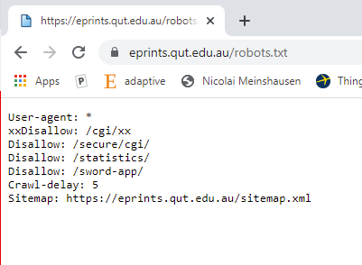
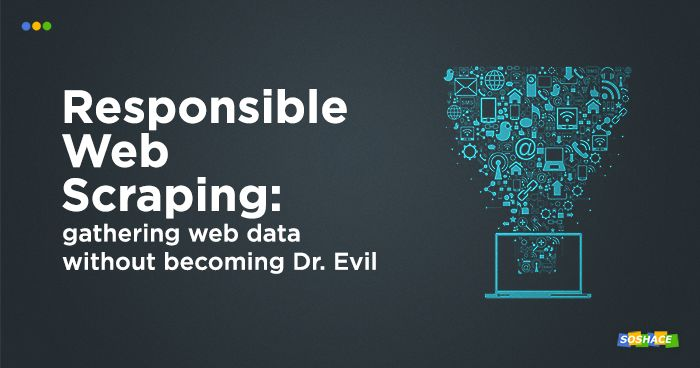
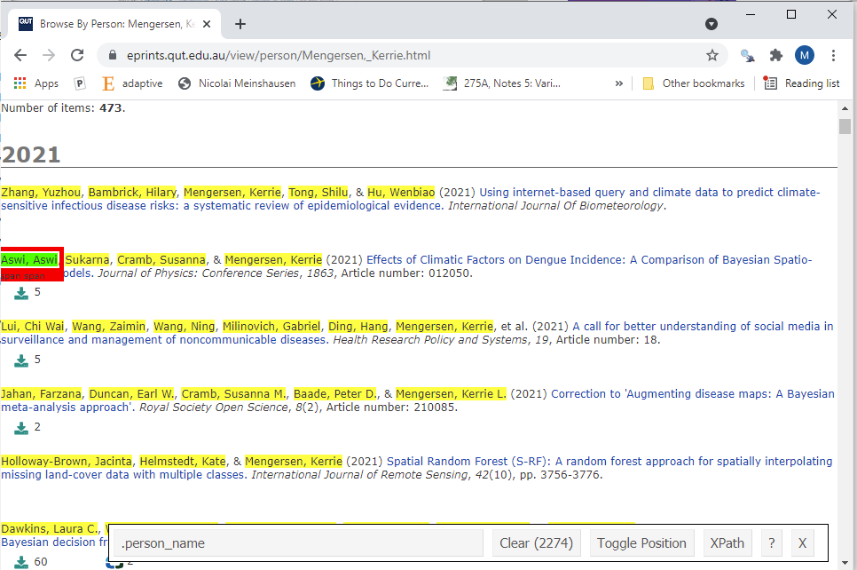

```{r setup, include=FALSE}
knitr::opts_chunk$set(echo = TRUE)
```

### A typical data challenge

You want to create a visualisation of a publicly available *data source* in order for people (end users) to adjust and gain some *insight* from the tool. 

### An example

Want to provide something to spark possible collaboration between QUT researchers based on publicly available data. Looking around QUT eprints is a great source! 

    Goal: Create a visuallisation of QUT researchers that people can view and interact with to find common coauthors

Need to get the data *(Web Scraping)* visualise it *(Network)* and provide something interactive *(Shiny)*.

Example end product: https://matt-sutton.shinyapps.io/CDSNetwork/ 

### Tools we'll need

R and Rstudio are my preferred software if you work with Python you may be interested in beautiful soup and pyvis.

Install and load the required packages:

```{r, eval=FALSE}
install.packages("shiny")
install.packages("visNetwork")
install.packages("rvest")
```

You'll also need the following Chrome Extension (https://selectorgadget.com/). Don't worry if  you can't get this one in the session you should be able to create the app without it. 

### Important references

To build this tool and tutorial I made use of the excellent tutorials by SAURAV KAUSHIK [1] for web scraping with R, ?? for building a shiny app and ?? for visualizing data with a network. 

## Web Scraping 

Web scraping opens up the possibilities working with data and creating data sources. You might consider:

1. scraping to generate data for recommender systems
2. scraping for sentiment analysis 
3. scraping data to build classification systems

There are several ways in which you can scrape data:

+ Copy-Paste
+ Application Programming Interface (API)
+ Document Object Model (DOM) - An API for HTML and XML documents

The best way to deal with data is to use an API that the website of interest has made available. In addition I'd mention that it is good practice to check the website robot.txt, read the terms and conditions of the website and scrape with moderate speed. 



There are best practices and you should try to get all data ethically [2].


### Scraping with R

Lets get some data! 
This process follows along with the steps from [1].

*Step 1:*
Try the following commands:

```{r}
library(rvest)

url <- "https://eprints.qut.edu.au/view/person/Mengersen,_Kerrie.html" 

scraped_html <- read_html(url)
```

This url contains the information of our centre director Distinguished Professor Kerrie Mengersen. In `scraped_html` we have access to all metadata on Kerrie's QUT published papers. This includes:

1. Co-authors
2. Journals
3. Published year
4. Article Name

*Step 2:*

To access pull this information out from the document we need to use the selector gadget. Click the extension link and select the relevant fields. 



Make sure that only the relevant part is selected - here a coauthor from a recent paper. By clicking multiple times it is possible to refine this selection. The text at the bottom is the required selector to get this information from our `scraped_html` object. For co-authors it's `.person_name`.

*Step 3:*

Using the selector you can grab the relevant part from the R object:

```{r}
co_authors_html <- html_nodes(scraped_html, ".person_name")

# Convert this to text
co_authors_text <- unique(html_text(co_authors_html))
```

You can use this to see the number of unique coauthors `length(co_authors_text)` (740) and other statistics.

## Building something with the data

Now that data can be pulled we can start finding something interesting to visualise. 

Grab the data from two authors:

```{r}
url <- "https://eprints.qut.edu.au/view/person/Mengersen,_Kerrie.html" 
scraped_html <- read_html(url)
co_authors_html <- html_nodes(scraped_html, ".person_name")
km_coauthors <- unique(html_text(co_authors_html))
Sys.sleep(5)
url <- "https://eprints.qut.edu.au/view/person/Vercelloni,_Julie.html" 
scraped_html <- read_html(url)
co_authors_html <- html_nodes(scraped_html, ".person_name")
jv_coauthors <- unique(html_text(co_authors_html))
```

We'll make a visualisation of the shared coauthors. Great visualisations are possible using the R package visNetwork [3]. 

The following code sets up a set of nodes for the shared authors and edges between those who have worked together. 

```{r}
library(visNetwork)
names <- c("Mengersen, Kerrie", "Vercelloni, Julie")
nodes <- unique(intersect(jv_coauthors, km_coauthors))

edges <- data.frame(from = c(rep("Mengersen, Kerrie",length(nodes)),
                             rep("Vercelloni, Julie",length(nodes))),
                    to = c(nodes, nodes))

nodes <- data.frame(id = nodes, label = nodes,
                    color.background = c(nodes %in% names))
visNetwork(nodes, edges, width = "100%")
```

## Creating a Shiny App

Now that we have some basic code that can pull data from the web and generate a visualisation the next step is to make it interactive. This is where Shiny comes in. A great resource for Shiny is [3] which gives a lot of background and extra information. 

A Shiny app is a way to build interactive web applications from R that you can publish online. 

Shiny apps consist of two main parts: a user interface (ui) and a server function. The following snippit creates a shiny app with a ui consisting of a title, sidebar and main panel rendering a plot.

UI:
```{r}
library(shiny)
# Define UI for app that draws a histogram ----
ui <- fluidPage(
  # App title ----
  titlePanel("Hello Shiny!"),

  # Sidebar layout with input and output definitions ----
  sidebarLayout(

    # Sidebar panel for output ----
    sidebarPanel(

      # Output: Which node is hovered over ----
      verbatimTextOutput("shiny_return")
    ),

    # Main panel for displaying outputs ----
    mainPanel(
      # Output: visNetwork ----
        visNetworkOutput("network")

    )
  )
)
```

The server does all the processing to render the content for th ui. 

```{r}
server <- function(input, output) {
  output$network <- renderVisNetwork({
    # minimal example
    nodes <- data.frame(id = 1:3, label = 1:3)
    edges <- data.frame(from = c(1,2), to = c(1,3))

    visNetwork(nodes, edges) %>%
      visInteraction(hover = TRUE) %>%
      visEvents(hoverNode = "function(nodes) {
        Shiny.onInputChange('current_node_id', nodes);
      ;}")
  })

  output$shiny_return <- renderPrint({
    input$current_node_id
  })
}
```

This can then be generated using the function `shinyApp(ui = ui, server = server)`.

```{r, echo=FALSE}
shinyApp(ui = ui, server = server)
```

## Putting it together

Building off the UI from the previous section we can replace the sidebar part with a text input box that accepts user names and a main panel that renders the Network output. 

```{r}
library(shiny)
require(visNetwork)
# Define UI ----
ui <- fluidPage(
  titlePanel("Networking Tool"),
  sidebarLayout(
    sidebarPanel(
      textInput("fname", h3("First Name"),
                value = "David Dimitri Kerrie"),
      textInput("lname", h3("Second Name"),
                value = "Lovell Perrin Mengersen"),
      submitButton("Update View", icon("refresh")),
      br(),
      br(),
      helpText("This tool has been developed for the QUT Centre",
               "of Data Science workshop Growing the Data Science",
               "Network: Mathematics and Computer Science."),
      br(),
      br(),
      h2("Instructions:"),
      helpText("The Networking tool scrapes information from QUT",
               "ePrints. Enter a list of first and second names ",
               "separated by spaces then hit refresh to update ",
               "the network. Common coauthors are linked by an ",
               "edge in the network.")
    ),

    mainPanel(
      visNetworkOutput("network", width = "100%", height = "20cm")
    )
  )
)
```

The server function takes in the input from the text box grabs the HTML from the relevant webpages. Code then processes the scrapped data into the form suited for visNetwork. This is then rendered on the visNetwork graph. 

```{r}
server = function(input, output) {
  output$network <- renderVisNetwork({
    # minimal example
    names_1 <- strsplit(input$fname, " ")[[1]]
    names_2 <- strsplit(input$lname, " ")[[1]]
    names <- paste(names_2,names_1, sep = ', ')

    library(rvest)
    library(ggplot2)
    n_authors <- length(names_1)
    list_wp <- vector("list", n_authors)

    for( au in 1:n_authors ){
      Sys.sleep(5)
      wp <- read_html(paste0("https://eprints.qut.edu.au/view/person/",names_2[au],",_", names_1[au],".html"))
      list_wp[[au]] <- wp %>% html_nodes(".person_name") %>% html_text() %>% unique()
    }

    ## Create a list of nodes (all collaborators shared)
    nodes <- names
    for( au_1 in 1:(n_authors-1) ){
      for( au_2 in (au_1+1):n_authors){
        nodes <- unique(c(nodes, intersect(list_wp[[au_1]], list_wp[[au_2]])))
      }
    }

    ## Create a list of edges (edge = shared collaborator)
    edges <- data.frame(from = NULL, to = NULL)

    for( au in 1:n_authors ){
      co_a <- intersect(list_wp[[au]], nodes)
      n_co_a <- length(co_a)
      if(length(co_a)>0){
        if( names[au] %in% co_a){
          from_a <- rep(names[au], n_co_a-1)
          to_a <- co_a[co_a != names[au]]
        } else {
          from_a <- rep(names[au], n_co_a)
          to_a <- co_a
        }
        edges <- rbind(edges,data.frame(from = from_a, to = to_a))
      }
    }

    nodes <- data.frame(id = nodes, label = nodes,
                        color.background = c(nodes %in% names))

    visNetwork(nodes, edges, height = "20cm", width = "100%") %>%
      visInteraction(hover = TRUE) %>%
      visEvents(hoverNode = "function(nodes) {
        Shiny.onInputChange('current_node_id', nodes);
      ;}")
  })
}

# Run the app ----
shinyApp(ui = ui, server = server)
```

## References:

1. SAURAV KAUSHIK, March, 2017: https://www.analyticsvidhya.com/blog/2017/03/beginners-guide-on-web-scraping-in-r-using-rvest-with-hands-on-knowledge/

2. DENIS KRYUKOV,September, 2019: https://soshace.com/responsible-web-scraping-gathering-data-ethically-and-legally/

3. https://datastorm-open.github.io/visNetwork/
