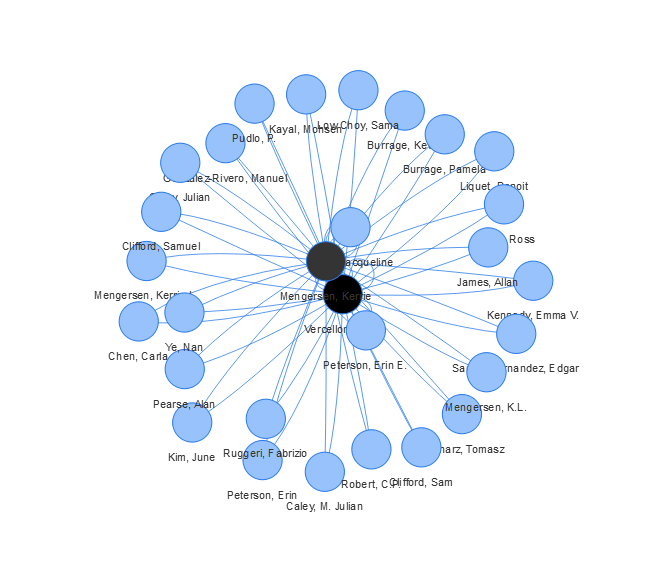

Network Visualisation
================

Now that data can be pulled we can start finding something interesting
to visualise.

Grab the data from two authors:

``` r
library(rvest)
url <- "https://eprints.qut.edu.au/view/person/Mengersen,_Kerrie.html" 
scraped_html <- read_html(url)
co_authors_html <- html_nodes(scraped_html, ".person_name")
km_coauthors <- unique(html_text(co_authors_html))
Sys.sleep(5)
url <- "https://eprints.qut.edu.au/view/person/Vercelloni,_Julie.html" 
scraped_html <- read_html(url)
co_authors_html <- html_nodes(scraped_html, ".person_name")
jv_coauthors <- unique(html_text(co_authors_html))
```

We’ll make a visualisation of the shared coauthors. Great visualisations
are possible using the R package visNetwork \[3\].

The following code sets up a set of nodes for the shared authors and
edges between those who have worked together.

``` r
library(visNetwork)
names <- c("Mengersen, Kerrie", "Vercelloni, Julie")
nodes <- unique(intersect(jv_coauthors, km_coauthors)) # The shared authors

# Make an edge between each of the coauthors
edges <- data.frame(from = c(rep("Mengersen, Kerrie",length(nodes)),
                             rep("Vercelloni, Julie",length(nodes))),
                    to = c(nodes, nodes))

# Make the nodes black if they match our "data generating" nodes
nodes <- data.frame(id = nodes, label = nodes,
                    color.background = c(nodes %in% names))
visNetwork(nodes, edges, width = "100%")
```

<!-- -->

Can you see any issues with the scraped data?

### Next section

Let’s put this together in an App [Next section](shiny_part.md)

### References:

There are a lot of possible ways to work with network data see the great
resource below

3.  <https://datastorm-open.github.io/visNetwork/>
