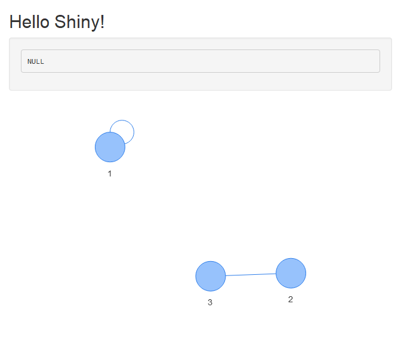
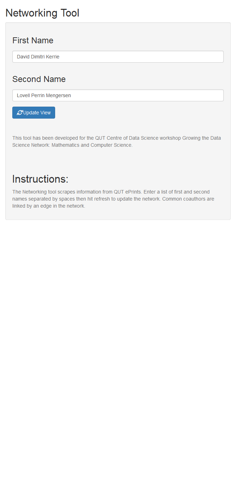

Making a Shiny App
================

Now that we have some code that can pull data from the web and code to
generate a visualisation from this data the next step is to make it
interactive. This is where Shiny comes in. A great resource for Shiny is
\[3\] which gives a lot of background on how to build up applications.

A Shiny app is a way to build interactive web applications from R that
you can publish online.

Shiny apps consist of two main parts: a user interface (ui) and a server
function. The following snippit creates a shiny app with a ui consisting
of a title, sidebar and main panel rendering a plot.

The following user interface code will build a panel and side-bar page
which is a popular structure for a user interface.

``` r
library(shiny)
library(rvest)
library(visNetwork)
# Define UI for app that draws a histogram ----
ui <- fluidPage(
  # App title ----
  titlePanel("Hello Shiny!"),

  # Sidebar layout with input and output definitions ----
  sidebarLayout(

    # Sidebar panel for output ----
    sidebarPanel(

      # Output: Which node is hovered over ----
      verbatimTextOutput("shiny_return")
    ),

    # Main panel for displaying outputs ----
    mainPanel(
      # Output: visNetwork ----
        visNetworkOutput("network")

    )
  )
)
```

The server does all the processing to render the content for th ui. Here
the server will render a visNetwork consisting of 3 nodes with 2 edges.
When you hover over a node this will register on the output box in the
UI.

``` r
server <- function(input, output) {
  output$network <- renderVisNetwork({
    # minimal example
    nodes <- data.frame(id = 1:3, label = 1:3)
    edges <- data.frame(from = c(1,2), to = c(1,3))

    visNetwork(nodes, edges) %>%
      visInteraction(hover = TRUE) %>%
      visEvents(hoverNode = "function(nodes) {
        Shiny.onInputChange('current_node_id', nodes);
      ;}")
  })

  output$shiny_return <- renderPrint({
    input$current_node_id
  })
}
```

To create the app you need to run the following
`shinyApp(ui = ui, server = server)`.

    ## 
    ## Listening on http://127.0.0.1:3350

<!-- -->

Many alternative user design options are available you can find more
examples of these at
<https://shiny.rstudio.com/gallery/widget-gallery.html>

## A final product

Building off the UI from the previous section we can replace the sidebar
part with a text input box that accepts user names and a main panel that
renders the Network output.

``` r
library(shiny)
require(visNetwork)
# Define UI ----
ui <- fluidPage(
  titlePanel("Networking Tool"),
  sidebarLayout(
    sidebarPanel(
      textInput("fname", h3("First Name"),
                value = "David Dimitri Kerrie"),
      textInput("lname", h3("Second Name"),
                value = "Lovell Perrin Mengersen"),
      submitButton("Update View", icon("refresh")),
      br(),
      br(),
      helpText("This tool has been developed for the QUT Centre",
               "of Data Science workshop Growing the Data Science",
               "Network: Mathematics and Computer Science."),
      br(),
      br(),
      h2("Instructions:"),
      helpText("The Networking tool scrapes information from QUT",
               "ePrints. Enter a list of first and second names ",
               "separated by spaces then hit refresh to update ",
               "the network. Common coauthors are linked by an ",
               "edge in the network.")
    ),

    mainPanel(
      visNetworkOutput("network", width = "100%", height = "20cm")
    )
  )
)
```

The server function takes in the input from the text box grabs the HTML
from the relevant webpages. Code then processes the scrapped data into
the form suited for visNetwork. This is then rendered on the visNetwork
graph.

``` r
server = function(input, output) {
  output$network <- renderVisNetwork({
    # minimal example
    names_1 <- strsplit(input$fname, " ")[[1]]
    names_2 <- strsplit(input$lname, " ")[[1]]
    names <- paste(names_2,names_1, sep = ', ')

    library(rvest)
    library(ggplot2)
    n_authors <- length(names_1)
    list_wp <- vector("list", n_authors)

    for( au in 1:n_authors ){
      Sys.sleep(5)
      wp <- read_html(paste0("https://eprints.qut.edu.au/view/person/",names_2[au],",_", names_1[au],".html"))
      list_wp[[au]] <- wp %>% html_nodes(".person_name") %>% html_text() %>% unique()
    }

    ## Create a list of nodes (all collaborators shared)
    nodes <- names
    for( au_1 in 1:(n_authors-1) ){
      for( au_2 in (au_1+1):n_authors){
        nodes <- unique(c(nodes, intersect(list_wp[[au_1]], list_wp[[au_2]])))
      }
    }

    ## Create a list of edges (edge = shared collaborator)
    edges <- data.frame(from = NULL, to = NULL)

    for( au in 1:n_authors ){
      co_a <- intersect(list_wp[[au]], nodes)
      n_co_a <- length(co_a)
      if(length(co_a)>0){
        if( names[au] %in% co_a){
          from_a <- rep(names[au], n_co_a-1)
          to_a <- co_a[co_a != names[au]]
        } else {
          from_a <- rep(names[au], n_co_a)
          to_a <- co_a
        }
        edges <- rbind(edges,data.frame(from = from_a, to = to_a))
      }
    }

    nodes <- data.frame(id = nodes, label = nodes,
                        color.background = c(nodes %in% names))

    visNetwork(nodes, edges, height = "20cm", width = "100%") %>%
      visInteraction(hover = TRUE) %>%
      visEvents(hoverNode = "function(nodes) {
        Shiny.onInputChange('current_node_id', nodes);
      ;}")
  })
}

# Run the app ----
shinyApp(ui = ui, server = server)
```

    ## 
    ## Listening on http://127.0.0.1:3611

<!-- -->

### Back to the start

Thanks for going through the tutorial [back to start](README.md)

### References:

There are a lot of possible ways to work with network data see the great
resource below

3.  <https://datastorm-open.github.io/visNetwork/>
