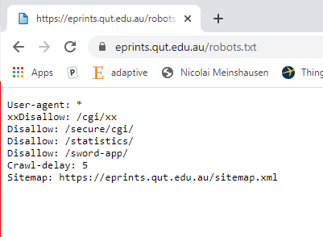
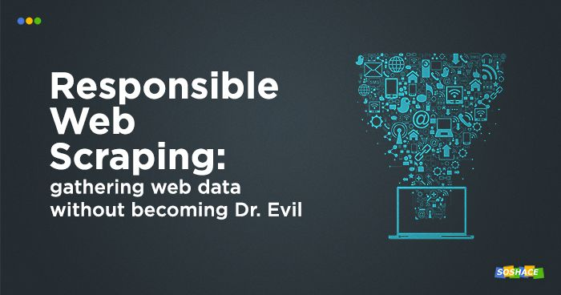
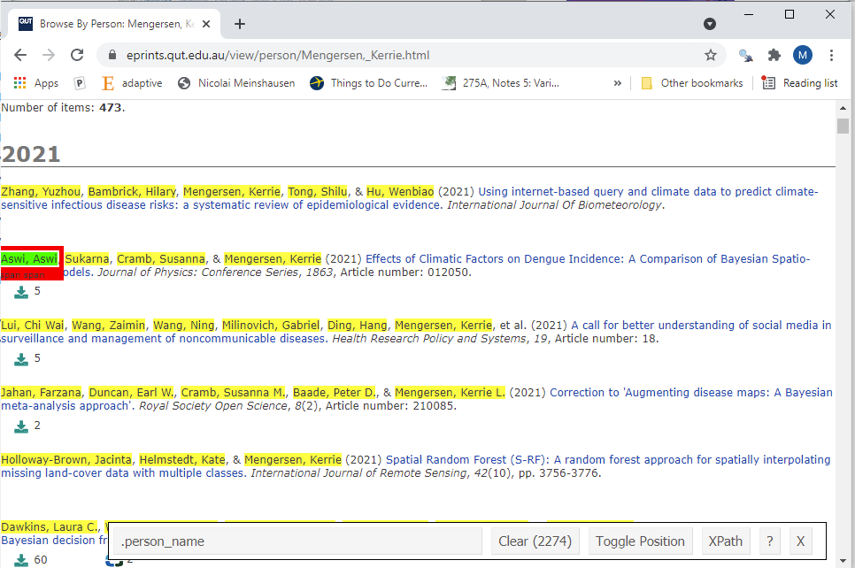

Web Scraping
================

Web scraping opens up the possibilities working with data and creating
data sources. You might consider:

1.  scraping to generate data for recommender systems
2.  scraping for sentiment analysis
3.  scraping data to build classification systems

There are several ways in which you can scrape data:

-   Copy-Paste
-   Application Programming Interface (API)
-   Document Object Model (DOM) - An API for HTML and XML documents

The best way to deal with data is to use an API that the website of
interest has made available. In addition I’d mention that it is good
practice to check the website robot.txt, read the terms and conditions
of the website and scrape with moderate speed.



There are best practices and you should try to get all data ethically
\[2\].


### Scraping with R

Lets get some data! This process follows along with the steps from
\[1\].

*Step 1:* Try the following commands:

``` r
library(rvest)
```

    ## Loading required package: xml2

``` r
url <- "https://eprints.qut.edu.au/view/person/Mengersen,_Kerrie.html" 

scraped_html <- read_html(url)
```

This url contains the information of our centre director Distinguished
Professor Kerrie Mengersen. In `scraped_html` we have access to all
metadata on Kerrie’s QUT published papers. This includes:

1.  Co-authors
2.  Journals
3.  Published year
4.  Article Name

*Step 2:*

To access pull this information out from the document we need to use the
selector gadget. Click the extension link and select the relevant
fields.



Make sure that only the relevant part is selected - here a coauthor from
a recent paper. By clicking multiple times it is possible to refine this
selection. The text at the bottom is the required selector to get this
information from our `scraped_html` object. For co-authors it’s
`.person_name`.

*Step 3:*

Using the selector you can grab the relevant part from the R object:

``` r
co_authors_html <- html_nodes(scraped_html, ".person_name")

# Convert this to text
co_authors_text <- unique(html_text(co_authors_html))
```

You can use this to look through the coauthors on different papers:

``` r
head(co_authors_text)
```

    ## [1] "Zhang, Yuzhou"     "Bambrick, Hilary"  "Mengersen, Kerrie"
    ## [4] "Tong, Shilu"       "Hu, Wenbiao"       "Aswi, Aswi"

``` r
length(co_authors_text)
```

    ## [1] 740

### Next section

Let’s get start building something with this data [Next
section](network_vis.md)

### References:

1.  SAURAV KAUSHIK, March, 2017:
    <https://www.analyticsvidhya.com/blog/2017/03/beginners-guide-on-web-scraping-in-r-using-rvest-with-hands-on-knowledge/>

2.  DENIS KRYUKOV,September, 2019:
    <https://soshace.com/responsible-web-scraping-gathering-data-ethically-and-legally/>
